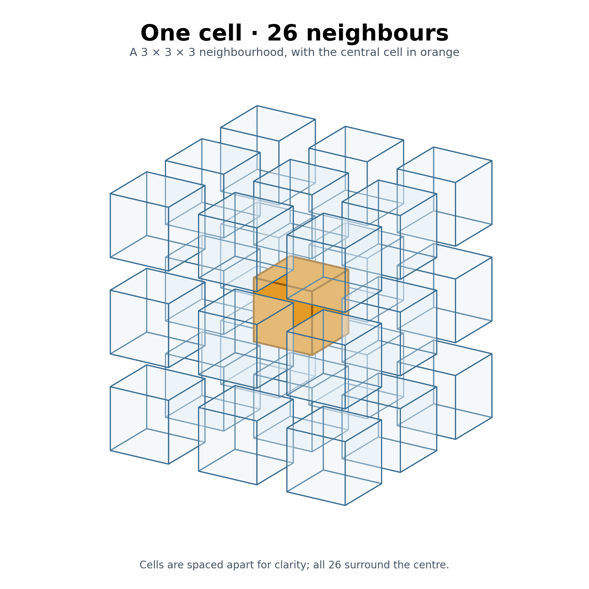
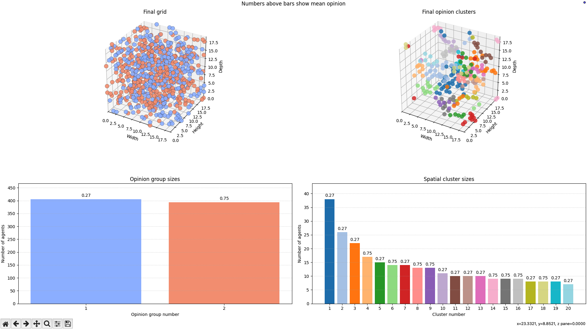
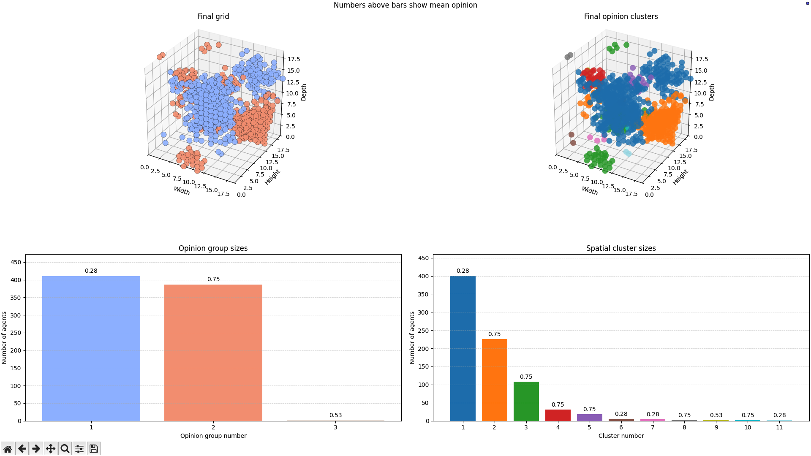

# Schelling's Model Of segregation implemented in 3D
Schellings model of segregation is a agent-based simulation that shows how the 
opinions of neighbors cause them to migrate, form groups, and change opinions 
based on certain parameters. It was originally implemented in 1971 by Thomas 
Schelling to explore whether severe residential segregation emerge 
even when individual residents are not strictly opposed to living in integrated 
neighborhoods. The model was implemented in 2D, as if you were looking at a 
neighborhood from a bird's-eye-view.

Schelling trapped agents on a flat, 2 dimensional chessboard. What happens when 
you tear up the board and give everyone another dimension of movement
(up and down)?

This is the question I am trying to answer with this project. 

## Overview
An agent is an occupied cell with an opinion greater than 0 and at most 1, with 0.5 being neutral; the value 0 is reserved for empty cells. Each agent is surrounded by 26 neighbour positions which, if occupied by other agents, are the "neighbors".



A consensus-compatible neighbour is an occupied neighbour whose opinion differs from the agent’s by less than the consensus threshold. A similar neighbour is an occupied neighbour whose opinion differs from the agent’s by less than the similarity threshold. 

For every timestep, agents may come to a consensus with consensus-compatible 
neighbours i.e adjust their opinions towards the mean opinion of consensus-compatible 
neighbours. For example, two center-right neighbors chatting over the fence slowly 
converge on the exact same Conservative policy stance.

Additionally, agents may decide to stay or relocate to a random unoccupied cell 
if the ratio of similar occupied neighbours to total occupied neighbours is below the segregation threshold.
For example, a lifelong Labour voter sells their house and relocates after the surrounding street becomes overwhelmingly Conservative.

Each timestep applies consensus first, then evaluates relocation using the updated opinions. Agents with no occupied neighbours have similarity 0. Dissatisfied agents can move only when empty destinations are available.

The 3D grid uses toroidal wrapping: each face connects to the opposite face. This removes boundary effects, so every cell has the same arrangement of 26 neighbour positions, including diagonals.

## Quick start
Run these commands from the repository folder: 

python3 -m pip install numpy matplotlib

python3 run_model.py 

This will run the default preset.

## Model rules

### Consensus update

Let $x_i(t)$ be agent $i$’s opinion at timestep $t$, and let $P_i(t)$ be the set of agents occupying neighbouring cells around agent $i$ at the start of that timestep. The index $j$ identifies a neighbouring agent, and $x_j(t)$ is that agent's opinion. Agent $i$’s consensus-compatible neighbours are:

$$
C_i(t) = \left\{j \in P_i(t) : |x_j(t) - x_i(t)| < \tau_c\right\},
$$

where $\tau_c$ is `--consensus-threshold`. $C_i(t)$ is the subset of agents in $P_i(t)$ whose opinion difference from agent $i$ is less than $\tau_c$, making them compatible for a consensus update. With consensus enabled, the updated opinion is:

$$
x_i(t+1) =
\begin{cases}
x_i(t) + \alpha\left(\dfrac{1}{|C_i(t)|}\displaystyle\sum_{j \in C_i(t)} x_j(t) - x_i(t)\right), & |C_i(t)| > 0, \\
x_i(t), & |C_i(t)| = 0.
\end{cases}
$$

Here, $\alpha$ is `--consensus-weight`, and $|C_i(t)|$ is the number of compatible neighbours. 

### Similarity and relocation

Similarity is calculated after the consensus update, using the updated opinions before any agents move. Agent $i$'s similar neighbours are:

$$
S_i(t) = \left\{j \in P_i(t) : |x_j(t+1) - x_i(t+1)| < \tau_s\right\},
$$

where $\tau_s$ is `--similarity-threshold`. $S_i(t)$ is the subset of agents in $P_i(t)$ whose updated opinion difference from agent $i$ is less than $\tau_s$. It contains the similar agents used for the relocation decision during timestep $t$, after consensus and before any agents move. The fraction of occupied neighbours that are similar is:

$$
s_i(t) =
\begin{cases}
\dfrac{|S_i(t)|}{|P_i(t)|}, & |P_i(t)| > 0, \\
0, & |P_i(t)| = 0.
\end{cases}
$$

Here, $s_i(t)$ is the similarity fraction, $|S_i(t)|$ is the number of similar neighbours, and $|P_i(t)|$ is the number of occupied neighbours. Vertical bars around a set mean its number of members.

For example, if 6 of 10 occupied neighbours are similar, then $|S_i(t)| = 6$, $|P_i(t)| = 10$, and $s_i(t) = 6/10 = 0.6$.

An agent is dissatisfied when

$$
s_i(t) < \tau_{\mathrm{seg}},
$$

where $\tau_{\mathrm{seg}}$ is `--segregation-threshold`. Agents with no occupied neighbours have similarity 0, so they are dissatisfied whenever this threshold is greater than 0. With segregation enabled, dissatisfied agents move to randomly selected empty cells. If there are fewer empty cells than dissatisfied agents, only a randomly selected subset moves; each destination is used at most once.

Execution is synchronous within each stage: all consensus updates use the opinions at the start of the timestep, then all relocation decisions use the resulting grid before any agents move. Relocation preserves each agent's updated opinion.

## Parameters

### Model settings

| Parameter | Default | Description |
|---|---:|---|
| `--grid-shape` | `20 20 20` | Grid depth, height, and width (`z, y, x`). |
| `--fraction-empty` | `0.9` | Fraction of cells that are empty |
| `--seed` | `2` | Random seed used to reproduce a run, change the seed to generate a different arrangement of agent locations|
| `--consensus` / `--no-consensus` | On | Enable or disable opinion updates. |
| `--consensus-threshold` | `0.2` | A neighbour can influence consensus when the opinion difference is below this value. |
| `--consensus-weight` | `0.06` | How far an opinion moves towards compatible neighbours' mean each step. |
| `--segregation` / `--no-segregation` | On | Enable or disable agent relocation. |
| `--similarity-threshold` | `0.2` | Two occupied neighbours count as similar when their opinion difference is below this value. |
| `--segregation-threshold` | `0.75` | An agent is dissatisfied when its fraction of similar occupied neighbours is below this value. |
| `--floodfill-threshold` | `0.01` | Threshold used to form spatial clusters. |
| `--opinion-group-threshold` | `0.02` | Maximum opinion spread within an opinion-only group. |

### Run and display settings

| Parameter | Default | Description |
|---|---:|---|
| `--presets` | `default` | Select a named preset. Individual options can override its values. |
| `--file` | None | Load an initial grid from a 3D NumPy `.npy` array. Its shape is stored in the file. |
| `--number-steps` | `200` | Number of simulation steps. |
| `--steps-per-plot` | `1` | Number of steps calculated between plot updates. |
| `--delay-per-plot` | `0.003` | Seconds to wait between plot updates. |
| `--graphs` / `--no-graphs` | Off | Show or hide the four time-series graphs. |
| `--grouping-graphs` / `--no-grouping-graphs` | Off | Show or hide the final clustering figure. |
| `--show-all-clusters-groups` | Off | Show every cluster and group instead of only the 20 largest. |


## Measurements and groups

Use `--graphs` to display four measurements over time:

- **Mean individual similarity:** the average of each agent's similarity fraction. Every agent has equal weight; isolated agents contribute zero.
- **Mean global similarity:** the total number of similar occupied neighbours divided by the total number of occupied neighbours across all agents. Agents with more neighbours contribute more to this measure.
- **Number of dissatisfied agents:** the number below the segregation threshold, measured after consensus but before relocation. This may exceed the number that move if there are too few empty destinations.
- **Opinion standard deviation:** the spread of occupied agents' opinions. A smaller value indicates greater agreement, but does not reveal whether those agents live together.

The similarity means and opinion standard deviation are measured after relocation. Both similarity means are reported as 1 for an empty grid; global similarity is also 1 when there are no occupied neighbour pairs. These are implementation conventions.

Use `--grouping-graphs` to apply the following algorithms to the final grid. They measure the result without changing it. Both exclude single-agent results. The plots show the 20 largest clusters and groups by default; use `--show-all-clusters-groups` to show all of them. Bar heights show sizes, and labels above the bars show mean opinions.

### Spatial clustering (flood fill)

Flood fill starts from an unvisited occupied cell and grows a cluster through all 26 neighbouring positions, including across wrapped boundaries. A candidate neighbour joins when

$$
|x_j - \mu_K| < \tau_f,
\qquad
\mu_K = \frac{1}{|K|}\sum_{k \in K} x_k.
$$

Where $K$ is the set of positions already in the cluster, $x_j$ is the candidate's opinion, $\mu_K$ is the cluster's mean opinion, and $\tau_f$ is `--floodfill-threshold`. The candidate must be occupied, unvisited, and adjacent to a cell in the current growth layer. The mean is calculated at before a new layer is being processesed as opposed to every time an agent is added to the cluster.

This algorithm reveals where connected communities with similar opinions have formed. Separated communities with similar opinions can form distinct spatial clusters. The changing mean means that the flood fill threshold dictates whether cells are added to the cluster, rather than the maximum difference between any two final members. The result can depend on which cell starts the cluster. Single-cell clusters and empty cells are labelled zero, as they are not clusters.

### Opinion grouping

What if clear groups of opinions have formed but are not spatially clustered? Opinion grouping ignores positions and sorts occupied agents' opinions from lowest to highest. A group starts with the lowest remaining opinion, and subsequent opinions join it when

$$
x_j - m_G < \tau_g,
\qquad
m_G = \min_{k \in G} x_k.
$$

Here, $G$ is the current group of agents, $x_j$ is the next opinion in sorted order, $m_G$ is the group's first and lowest opinion, and $\tau_g$ is `--opinion-group-threshold`. This reference opinion stays fixed. When an opinion fails the condition, it starts a new group, becoming the lowest opinon cell. Groups containing only one agent are removed.

For example, with a threshold of 0.05, opinions 0.10 and 0.14 share a group, but 0.18 starts another and becomes the lowest opinion cell of the group. It is compared with 0.10, not 0.14. The opinion range within each retained group is strictly less than the threshold.

This reveals how many opinion groups exist and how many agents belong to each, regardless of where they live. One opinion group can span several disconnected spatial clusters. Together, these algorithms distinguish agreement across the population from the formation of local communities. Their results also depend on their separate thresholds.

```bash
python3 run_model.py --graphs --grouping-graphs
```

### Example results

These runs show why spatial clustering and opinion grouping measure different things.

**Segregation threshold 0.9, 400 steps, the rest of the parameters are default.**

```bash
python3 run_model.py --segregation-threshold 0.9 --number-steps 200 --grouping-graphs
```



Two large opinion groups have formed, but agents remain spatially mixed and the displayed spatial clusters are much smaller.Agreement within opinion groups does not necessarily mean those agents form connected communities. Many agents have been removed from the clustered grid as they do not form clusters. 

**Segregation threshold 0.79, 400 steps, the rest of the parameters are default.**

```bash
python3 run_model.py --segregation-threshold 0.79 --number-steps 400 --grouping-graphs
```



Two dominant opinion groups are again visible, alongside much larger spatial clusters. Several spatial clusters have similar mean opinions, showing that one opinion group can form spatially separate communities.

## Load a NumPy grid

Use `--file` to load a saved 3D array instead of generating a random grid:

```bash
python3 run_model.py --file example_grids/starburst.npy
```

To create your own grid, run this Python code (for example, save it as `create_grid.py` and run `python3 create_grid.py`):

```python
import numpy as np

grid = np.zeros((20, 20, 20))
grid[5, 5, 5] = 0.3
grid[5, 5, 6] = 0.7
np.save("my_grid.npy", grid)
```

Then load it:

```bash
python3 run_model.py --file my_grid.npy
```

The array is indexed as `grid[z, y, x]` (depth, height, width). Zero means an empty cell; opinions greater than zero and at most 1 represent agents. The file must contain a non-empty 3D array of finite real numeric values between 0 and 1. Integer arrays are converted to floating point so opinions can change during consensus.

When loading a file, `--grid-shape` and `--fraction-empty` do not determine the initial grid, however other parameters still apply.

See [example_grids/README.md](example_grids/README.md) for the supplied hollow cube, starburst, double helix, and layered sphere arrays.

## Tests

Run the tests from the repository folder after installing the dependencies listed in Quick start:

```bash
python3 tests.py
```

The tests check NumPy grid loading, grid creation, toroidal wrapping, consensus updates, similarity calculations, dissatisfaction, relocation, spatial clustering, and opinion grouping; they use Python assertions.

A successful run ends with `All tests passed`. A failed assertion stops the run and identifies the check that failed. These tests check implementation behaviour and do not establish that the model accurately represents real-world segregation.

## Limitations

This model is exploratory and has not been checked against real segregation data. It shows the results of its chosen parameters and rules, rather than predicting how real communities behave.

- **Simplified agents and movement.** Each agent has one opinion value, and all agents share the same thresholds and consensus weight. The model does not include things like housing costs, social relationships, or differences in individual preferences. Futhermore, dissatisfied agents choose random empty destinations at any distance away from them without checking whether the move will improve their neighbourhood similarity. A fully occupied prevents relocation, even when agents are dissatisfied.

- **Non-realistic space and update rules.** The grids has toroidal wrapping so agents on opposite faces can be neighbours. All 26 neighbour positions have equal influence, despite different  distances from the centre cell. Consensus happens before relocation, and updates are synchronous within each stage; other update orders may produce different outcomes. 

- **Group definitions affect the conclusions.** Spatial clusters depend on the floodfill threshold, the starting cell, and the mean that is recalculated between growth layers. Opinion groups depend on a separate threshold and a fixed minimum opinion for each group.  Single agent results are excluded in the clustering graphs.

- **Summary is not extensive** Similarity averages and opinion standard deviation do not describe the complete spatial arrangement. Similar opinions can occur in disconnected communities, and clusters connected across a wrapped boundary can appear separate in the plot. The measurements should therefore be interpreted alongside the grid and grouping figures.

- **Larger grids are slower.** Doubling all three dimensions creates eight times as many cells. Repeated neighbour calculations, flood fill, and plotting can become slow, high proportions of occupied cells make individual agents harder to distinguish and also contribute to rendering slowness.

## Reflections

With more time, I would add rules and parameters that make the simulation more realistic. For example, instead of relocating instantly across the grid, an agent could choose a destination and have a maximum distance it can travel per timestep, spreading its journey across several steps. This would also introduce new questions, like what happens if another agent reaches the destination first.

Additionally, some agents could have more influence than others, or be more easily influenced themselves. Giving each agent its own consensus weight would allow some opinions to change quickly while others remain more resistant. I would also like to explore individual agent similarity and segregation thresholds, rather than assuming that every agent has the same preferences.

I created the 3D version to build on the knowledge and interest I gained from developing my earlier 2D implementation of Schelling’s segregation model (IPP.py) for my university programming and algorithms module. The neighbourhood increased from 8 positions to 26, and a grid with the same number of cells along each axis became much larger; a 20x20 2D grid would have 400 cells, whilst a 20x20x20 would have 8000.

Repeating consensus and similarity update calculations in Python loops every timestep would add considerable overhead. Therefore, in the 3D version, I generate the neighbour offsets and use NumPy operations, including `np.roll` and Boolean masks, to calculate consensus and similarity across the grid. This developed my understanding of multidimensional arrays, vectorisation, and how the way I implement an algorithm affects its computational cost.

Relocation also required more careful handling. The 2D version moves agents one at a time and looks for empty destinations in the grid as it changes. Whilst the 3D version selects movers and unique destinations before applying the moves together. This made me think more carefully about synchronous updates, preventing agents from jumping to the same cell, and preserving the number of agents. I also separated the model, plotting, presets, and tests into different files, making the project easier to read and extend.

 Extending the flood-fill algorithm and adding opinion grouping helped me distinguish spatial communities from agreement in opinion. This was an important lesson: a convincing-looking plot is not enough on its own, and different measurements answer different questions. 
 
 Alongside the modelling, I developed skills in Matplotlib visualisation, testing edge cases, validating array inputs, running reproducible experiments with random seeds, and explaining algorithms using both words and mathematical notation (written in LaTex).

Eventually, I would also like to train a predictive model on the simulation results; perhaps I will do this after my completing 'Methods of Artificial Intelligence' unit at university. Using data from runs with different parameters and initial conditions, I would like to investigate whether the final similarity, dissatisfaction, or opinion spread can be predicted from the settings and early measurements. This would extend the project into machine learning, while keeping the aim clear: predicting the behaviour of this simulation, rather than predicting real-world segregation.
