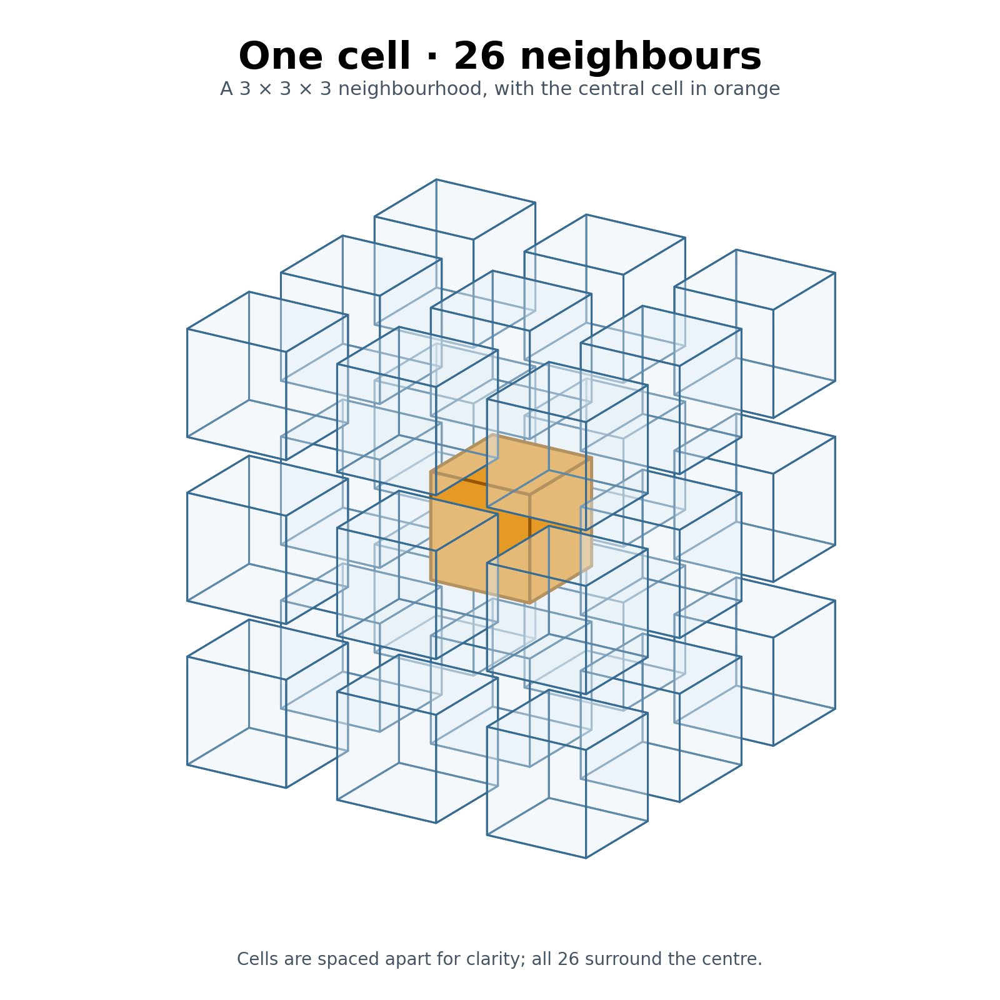
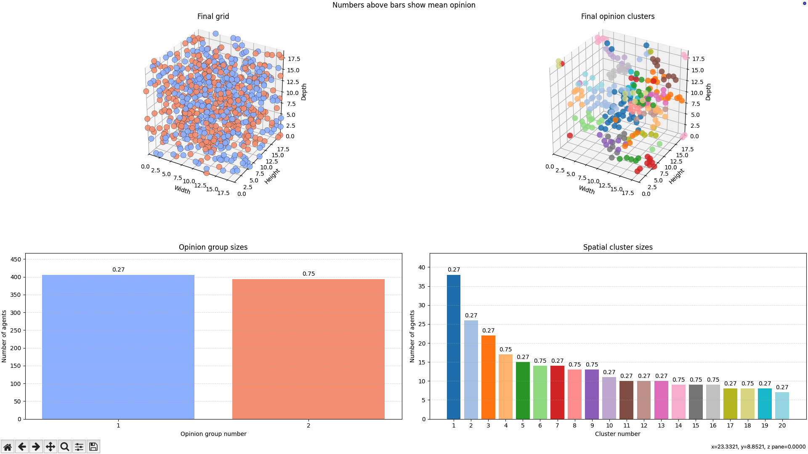
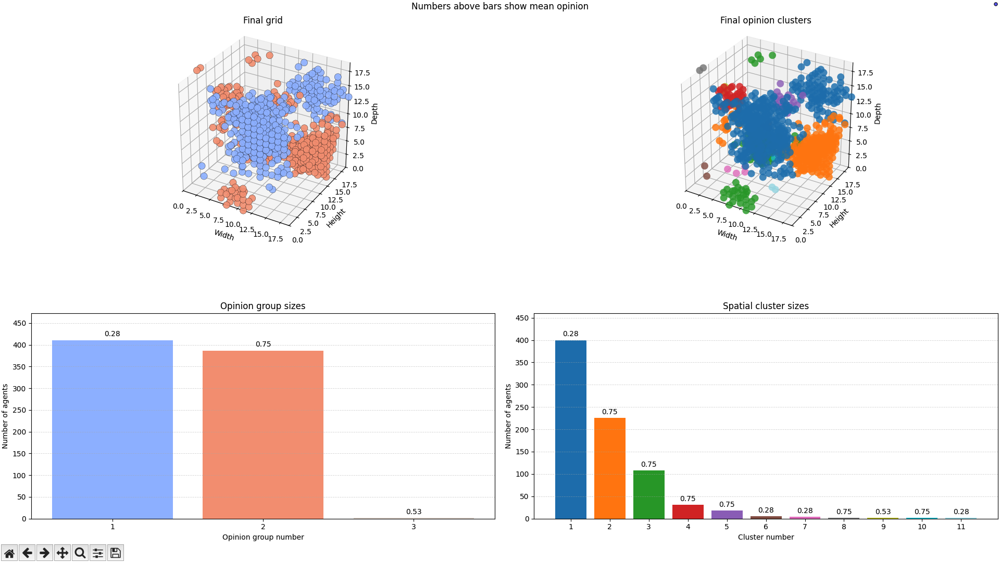

# Schelling's Model Of segregation implemented in 3D
What happens when you take a classic segregation model and give every agent a third dimension to move through? I built a simulation to find out.

During my first year at university, I built Schelling’s model of segregation for my summative assessment in my CPA (Computer Programming and Algorithms) class. Schelling’s model is a two-dimensional agent-based model that demonstrates how individual preferences for neighbours of the same type can lead to large-scale residential segregation.

Although my submission received a high mark (77%), the marking was limited to code readability and correctness. I was motivated to expand upon these fundamentals and rebuild the model from scratch, this time with more efficient and cleaner code

We live in a three-dimensional world, so what happens when the model is extended into 3D, allowing agents and neighbourhoods to form across height, depth, and width?

I decided to develop a 3D variant of Schelling’s segregation model using vectorised NumPy operations for efficient simulation. This model tracks both spatial clustering and opinion-group formation. Instead of only measuring only local similarity, it also quantifies how segregation emerges through opinion distributions, cluster structure, and global similarity.

The 2D version developed as part of my course uses Python loops for updates. Each agent checks its neighbours individually, evaluates similarity, decides whether it is dissatisfied, and potentially moves to an empty cell. The code is easy to read and understand, but gets really slow as the model becomes more complex, especially in 3D, where each cell has 26 neighbours instead of 8.

The 3D version instead uses NumPy arrays and vectorised functions such as np.roll and Boolean array masks. Similarity and consensus is calculated across the entire grid simultaneously, and toroidal is wrapping handled by array shifts rather than nested Python logic.

In a benchmark test using the same parameter settings, the 2D implementation took approximately 4.32 seconds for 100 updates on a 50 x 50 grid, while the 3D NumPy version took approximately 0.1 seconds on a 14 x 14 x 14 grid. That's a 40x increase in runtime.

Links to the 2D and 3D project repositories as well as the 3D web version are below. The web version is best for quick exploration but is a bit slow, however the terminal version is faster and better for repeated simulations and parameter testing.

## Overview
An agent is an occupied cell with an opinion greater than 0 and at most 1, with 0.5 being neutral; the value 0 is reserved for empty cells. Each agent is surrounded by 26 neighbour positions which, if occupied by other agents, are the "neighbors".



A consensus-compatible neighbour is an occupied neighbour whose opinion differs from the agent’s by less than the consensus threshold. A similar neighbour is an occupied neighbour whose opinion differs from the agent’s by less than the similarity threshold. 

For every timestep, agents may come to a consensus with consensus-compatible 
neighbours i.e adjust their opinions towards the mean opinion of consensus-compatible 
neighbours. For example, two center-right neighbors chatting over the fence slowly 
converge on the exact same Conservative policy stance.

Additionally, agents may decide to stay or relocate to a random unoccupied cell 
if the ratio of similar occupied neighbours to total occupied neighbours is below the segregation threshold.
For example, a lifelong Labour voter sells their house and relocates after the surrounding street becomes overwhelmingly Conservative.

Each timestep applies consensus first, then evaluates relocation using the updated opinions. Agents with no occupied neighbours have similarity 0. Dissatisfied agents can move only when empty destinations are available.

The 3D grid uses toroidal wrapping: each face connects to the opposite face. This removes boundary effects, so every cell has the same arrangement of 26 neighbour positions, including diagonals.

## Quick start
Run these commands from the repository folder: 

python3 -m pip install numpy matplotlib

python3 run_model.py 

This will run the default preset.

## Model rules

### Consensus update

Let $x_i(t)$ be agent $i$’s opinion at timestep $t$, and let $P_i(t)$ be the set of agents occupying neighbouring cells around agent $i$ at the start of that timestep. The index $j$ identifies a neighbouring agent, and $x_j(t)$ is that agent's opinion. Agent $i$’s consensus-compatible neighbours are:

$$
C_i(t) = \left\{j \in P_i(t) : |x_j(t) - x_i(t)| < \tau_c\right\},
$$

where $\tau_c$ is `--consensus-threshold`. $C_i(t)$ is the subset of agents in $P_i(t)$ whose opinion difference from agent $i$ is less than $\tau_c$, making them compatible for a consensus update. With consensus enabled, the updated opinion is:

$$
x_i(t+1) =
\begin{cases}
x_i(t) + \alpha\left(\dfrac{1}{|C_i(t)|}\displaystyle\sum_{j \in C_i(t)} x_j(t) - x_i(t)\right), & |C_i(t)| > 0, \\
x_i(t), & |C_i(t)| = 0.
\end{cases}
$$

Here, $\alpha$ is `--consensus-weight`, and $|C_i(t)|$ is the number of compatible neighbours. 

### Similarity and relocation

Similarity is calculated after the consensus update using the updated opinions before any agents are relocated. Agent $i$'s similar neighbours are:

$$
S_i(t) = \left\{j \in P_i(t) : |x_j(t+1) - x_i(t+1)| < \tau_s\right\},
$$

where $\tau_s$ is `--similarity-threshold`. $S_i(t)$ is the subset of agents in $P_i(t)$ whose updated opinion difference from agent $i$ is less than $\tau_s$. It contains the similar agents used for the relocation decision during timestep $t$, after consensus and before any agents move. The fraction of occupied neighbours that are similar is:

$$
s_i(t) =
\begin{cases}
\dfrac{|S_i(t)|}{|P_i(t)|}, & |P_i(t)| > 0, \\
0, & |P_i(t)| = 0.
\end{cases}
$$

Here, $s_i(t)$ is the similarity fraction, $|S_i(t)|$ is the number of similar neighbours, and $|P_i(t)|$ is the number of occupied neighbours. Vertical bars around a set is its cardinality.

For example, if 6 of 10 occupied neighbours are similar, then $|S_i(t)| = 6$, $|P_i(t)| = 10$, and $s_i(t) = 6/10 = 0.6$.

An agent is dissatisfied when

$$
s_i(t) < \tau_{\mathrm{seg}},
$$

where $\tau_{\mathrm{seg}}$ is `--segregation-threshold`. Agents with no occupied neighbours have similarity 0, so they are dissatisfied whenever this threshold is greater than 0. With segregation enabled, dissatisfied agents move to randomly selected empty cells. If there are fewer empty cells than dissatisfied agents, only a randomly selected subset of agents are relocated. 

Execution is synchronous within each stage: consensus updates are calculated for all agents at once using the opinions at the start of the timestep, then all similarity updates are calculated for all agents at once and use the resulting grid before any agents move. Relocation preserves each agent's updated opinion.

## Parameters

### Model settings

| Parameter | Default | Description |
|---|---:|---|
| `--grid-shape` | `20 20 20` | Grid depth, height, and width (`z, y, x`). |
| `--fraction-empty` | `0.9` | Fraction of cells that are empty |
| `--seed` | `2` | Random seed used to reproduce a run, change the seed to generate a different arrangement of agent locations|
| `--consensus` / `--no-consensus` | On | Enable or disable opinion updates. |
| `--consensus-threshold` | `0.2` | A neighbour can influence consensus when the opinion difference is below this value.|
| `--consensus-weight` | `0.06` | How far an opinion moves towards compatible neighbours' mean each step. |
| `--segregation` / `--no-segregation` | On | Enable or disable agent relocation. |
| `--similarity-threshold` | `0.2` | Two occupied neighbours count as similar when their opinion difference is below this value. |
| `--segregation-threshold` | `0.75` | An agent is dissatisfied when its fraction of similar occupied neighbours is below this value. |
| `--floodfill-threshold` | `0.01` | Threshold used to form spatial clusters. |
| `--opinion-group-threshold` | `0.02` | Maximum opinion spread within an opinion-only group. |

### Run and display settings

| Parameter | Default | Description |
|---|---:|---|
| `--presets` | `default` | Select a named preset. Individual options can override its values. |
| `--file` | None | Load an initial grid from a 3D NumPy `.npy` array. Its shape is stored in the file. |
| `--number-steps` | `200` | Number of simulation steps. |
| `--steps-per-plot` | `1` | Number of steps calculated between plot updates. |
| `--delay-per-plot` | `0.003` | Seconds to wait between plot updates. |
| `--graphs` / `--no-graphs` | Off | Show or hide the four time-series graphs. |
| `--grouping-graphs` / `--no-grouping-graphs` | Off | Show or hide the final clustering figure. |
| `--show-all-clusters-groups` | Off | Show every cluster and group instead of only the 20 largest. |


## Measurements and groups

Use `--graphs` to display four measurements over time:

- **Mean individual similarity:** the average of each agent's similarity fraction (similar nieghbors/total neighbors). Every agent has equal weight in producing the mean and isolated agents contribute zero.
- **Mean global similarity:** the total number of similar occupied neighbours divided by the total number of occupied neighbours across all agents. Agents with more neighbours have more weight in this measure.
- **Number of dissatisfied agents:** the number of agents below the segregation threshold, measured after consensus but before relocation. This may exceed the number that move if there are too few empty destination cells.
- **Opinion standard deviation:** the spread of occupied agents' opinions. A smaller value means greater agreement, but does not reveal whether those agents a happy living together.

The similarity means and opinion standard deviation are measured after relocation.

### Spatial clustering (flood fill)

Use `--grouping-graphs` to apply the following algorithms to the final grid. Both exclude single-agent results. The plots show the 20 largest clusters and groups by default as too many clusters make the graphs too crowded. Use `--show-all-clusters-groups` to show all of them. Bar heights show sizes, labels above the bars show mean opinions.

Flood fill starts from an unvisited occupied cell and grows a cluster through all 26 neighbouring positions, including across toroidal boundaries. A candidate neighbour joins when

$$
|x_j - \mu_K| < \tau_f,
\qquad
\mu_K = \frac{1}{|K|}\sum_{k \in K} x_k.
$$

Where $K$ is the set of positions already in the cluster, $x_j$ is the candidate's opinion, $\mu_K$ is the cluster's mean opinion, and $\tau_f$ is `--floodfill-threshold`. The candidate must be occupied, unvisited, and a neighbor to a cell in the current growth layer. The mean is calculated at before a new layer is being processesed, not every time an agent is added to the cluster.

This algorithm reveals where connected clusters with similar opinions have formed. Separated clusters with similar opinions can form distinct spatial clusters. The changing mean indicates that the flood fill threshold dictates whether cells are added to the cluster, rather than the maximum difference between any two final members like in the opinion grouping algorithm.

### Opinion grouping

What if clear groups of opinions have formed but are not spatially clustered? Opinion grouping ignores positions and sorts occupied agents' opinions from lowest to highest. A group starts with the lowest remaining opinion, and subsequent opinions join it when

$$
x_j - m_G < \tau_g,
\qquad
m_G = \min_{k \in G} x_k.
$$

Here, $G$ is the current group of agents, $x_j$ is the next opinion in sorted order, $m_G$ is the group's first and lowest opinion, and $\tau_g$ is `--opinion-group-threshold`. When an opinion fails the condition, it starts a new group, becoming the lowest opinon cell. Groups containing only one agent are removed.

For example, with a threshold of 0.05, opinions 0.10 and 0.14 share a group, but 0.18 starts another and becomes the lowest opinion cell of the group. It was compared with 0.10, not 0.14. The opinion range within each retained group is strictly less than the threshold.

This reveals how many opinion groups exist and how many agents belong to each, regardless of where they live. One opinion group can span several disconnected spatial clusters. 

Together, these algorithms distinguish agreement across the population from the formation of local clusters. Their results also depend on their separate thresholds.

```bash
python3 run_model.py --graphs --grouping-graphs
```

### Example results

These runs show why spatial clustering and opinion grouping measure different things.

**Segregation threshold 0.9, 400 steps, the rest of the parameters are default.**

```bash
python3 run_model.py --segregation-threshold 0.9 --number-steps 200 --grouping-graphs
```



Two large opinion groups have formed, but agents remain spatially mixed and the displayed spatial clusters are much smaller.Agreement within opinion groups does not necessarily mean those agents form connected clusters. Many agents have been removed from the clustered grid as they do not form clusters. 

**Segregation threshold 0.79, 400 steps, the rest of the parameters are default.**

```bash
python3 run_model.py --segregation-threshold 0.79 --number-steps 400 --grouping-graphs
```



Two dominant opinion groups are again visible, alongside much larger spatial clusters. Several spatial clusters have similar mean opinions, showing that one opinion group can form spatially separate clusters.

## Load a NumPy grid

Use `--file` tod a saved 3D array instead of generating a random grid:

```bash
python3 run_model.py --file example_grids/starburst.npy
```

To create your own grid, run this Python code (for example, save it as `create_grid.py` and run `python3 create_grid.py`):

```python
import numpy as np

grid = np.zeros((20, 20, 20))
grid[5, 5, 5] = 0.3
grid[5, 5, 6] = 0.7
np.save("my_grid.npy", grid)
```

Then load it:

```bash
python3 run_model.py --file my_grid.npy
```

The array is indexed as `grid[z, y, x]` (depth, height, width). The file must contain a non-empty 3D array of finite real numeric values between 0 and 1. Integer arrays are converted to floating point so opinions can change during consensus.

When loading a file, `--grid-shape` and `--fraction-empty` do not determine the initial grid, however other parameters still apply.

See [example_grids](example_grids/README.md) for some example grids you can load into the simulation.
## Tests

Run the tests from the repository folder after installing the libraries listed in Quick start:

```bash
python3 tests.py
```

The tests check NumPy grid loading, grid creation, toroidal wrapping, consensus updates, similarity calculations, dissatisfaction, relocation, spatial clustering, and opinion grouping. They use Python assertions.

A successful run ends with `All tests passed`. A failed assertion stops the run and shows the check that failed. These tests check implementation behaviour, they are not there to show that the model mimicks real world behaviour.

## Limitations

This model is exploratory and has not been checked against real segregation data. It shows the results of its chosen parameters and rules.

- **Simplified agents and movement.** Each agent has one opinion and all agents share the same thresholds and consensus weight. The model does not include parameters such as housing costs, social relationships, or differences in individual preferences. Futhermore, dissatisfied agents choose random empty destinations at any distance away from them without checking whether their neighbors will be similar or not. A fully occupied grid will prevent relocation, agents cannot swap positions in a single time step, even when agents are dissatisfied.

- **Non-realistic space and update rules.** The grids has toroidal wrapping, therefore agents on opposite faces are still neighbours. All 26 neighbour positions have equal influence, despite different distances from the centre cell. Consensus updates happen before relocation, and updates are synchronous every timestep. 

- **Group results depend on the parameters.** Spatial clusters depend on the flood fill threshold and the mean that is recalculated between growth layers. Opinion groups depend on a opinion group threshold and a minimum opinion for each group. Single agent results are not included in the clustering graphs.

- **Summary is not extensive** Similarity averages and opinion standard deviation do not show the the complete arrangement of agents after the simulation ends. Similar opinions can occur in different spatial clusters, and clusters connected across faces can look disconnected in the final plot.

- **Larger grids are slower.** If all three dimensions were doubled it would create eight times as many cells meaning repeated neighbour calculations, flood fill, and plotting becomes slower. A high occupied fraction grid can make individual agents harder to look at individually and contributes massively to rendering slowness.

## Reflections

With more time, I would add rules and parameters that make the simulation more realistic. For example, instead of relocating instantly across the grid, an agent could choose a destination and have a maximum distance it can travel per timestep, spreading its journey across several steps. This would also introduce new questions, like what happens if another agent reaches the destination first.

Additionally, some agents could have more influence than others, or be more easily influenced themselves. Giving each agent its own consensus weight would allow some opinions to change quickly while others remain more resistant. I would also like to explore individual agent similarity and segregation thresholds, rather than assuming that every agent has the same preferences.

I created the 3D version to build on the knowledge and interest I gained from developing my earlier 2D implementation of Schelling’s segregation model (IPP.py) for my university programming and algorithms module. The neighbourhood increased from 8 positions to 26, and a grid with the same number of cells along each axis became much larger; a 20x20 2D grid would have 400 cells, whilst a 20x20x20 would have 8000.

Repeating consensus and similarity update calculations in Python loops every timestep would add considerable overhead. Therefore, in the 3D version, I generate the neighbour offsets and use NumPy operations, including np.roll and Boolean masks, to calculate consensus and similarity across the grid. This developed my understanding of multidimensional arrays, vectorisation, and how the way I implement an algorithm affects its computational cost.

I had to think more carefully about agent relocation time time around. The 2D version relocates agents one at a time and looks for empty destinations in the grid as it changes whilst the 3D version selects agents who will move and relocates them synchronously in a single time-step This made me think more carefully about synchronous updates, preventing agents from moving to the same destination cell, and preserving the number of agents. I also separated the model, plotting, presets, and tests into different files, which made the project more organised than the 2D version.

I felt that the spatial grouping algorithm was not enough on its own as I would often observe a high dissatisfaction rate whilst no spatial clusters were being formed. Adding the opinion grouping algorithm helped me distinguish spatial communities from agreement in opinion. 

I developed skills in Matplotlib visualisation, testing edge cases, validating array inputs, running reproducible experiments with random seeds, and explaining algorithms using both words and mathematical notation (written in LaTex).

Eventually, I would also like to train a predictive model on the simulation results; perhaps I will do this after my completing 'Methods of Artificial Intelligence' unit at university. Using data from runs with different parameters and initial conditions, I would like to investigate whether the final similarity, dissatisfaction, or opinion spread can be predicted from the settings and early measurements. 